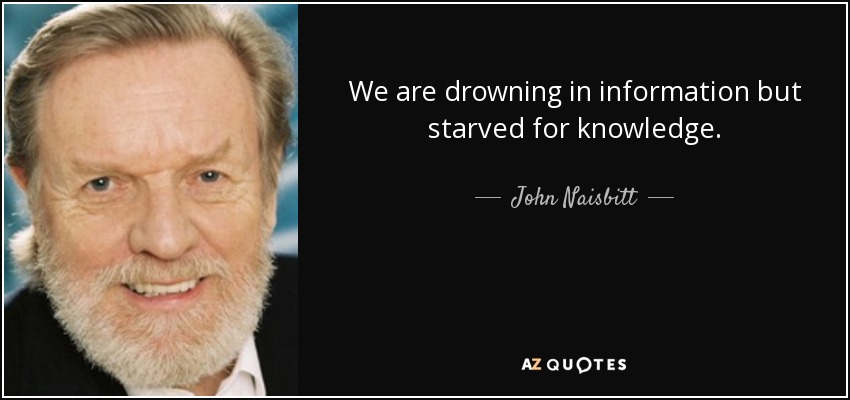
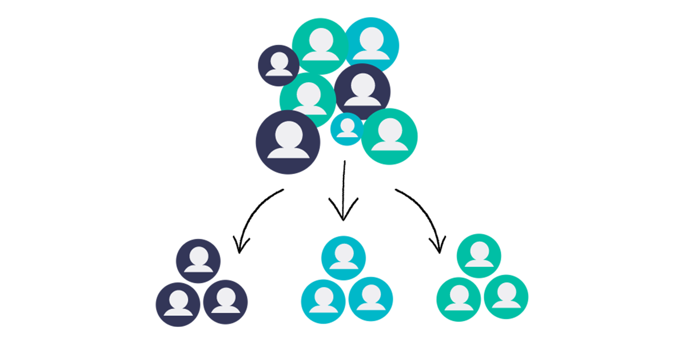
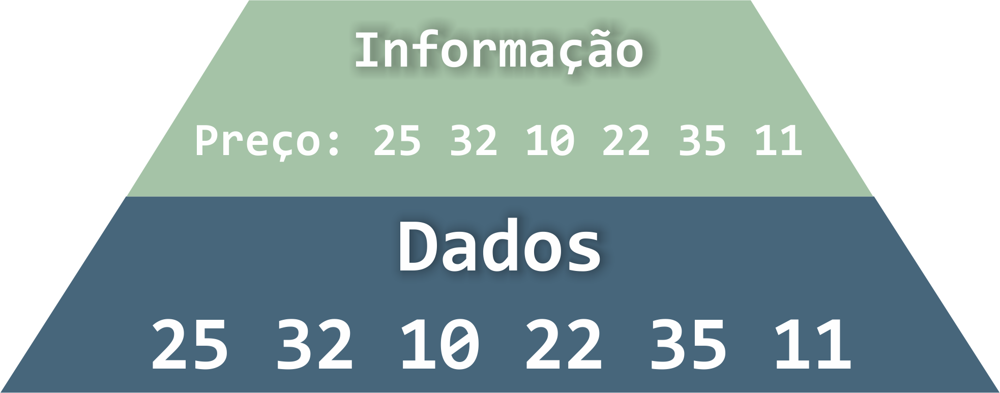
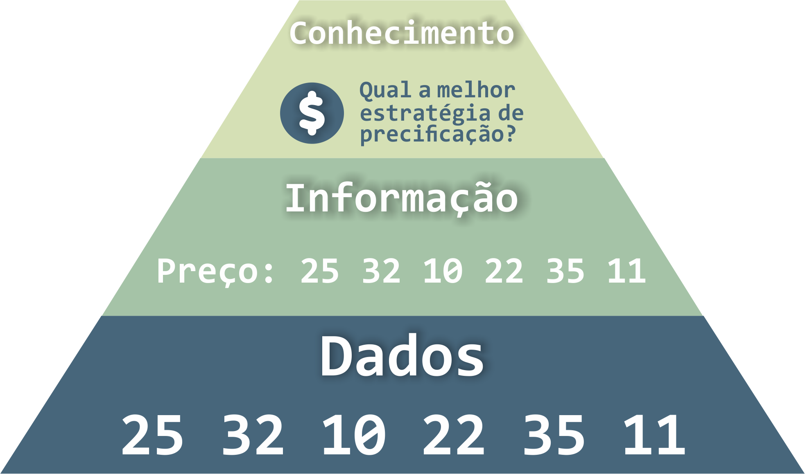
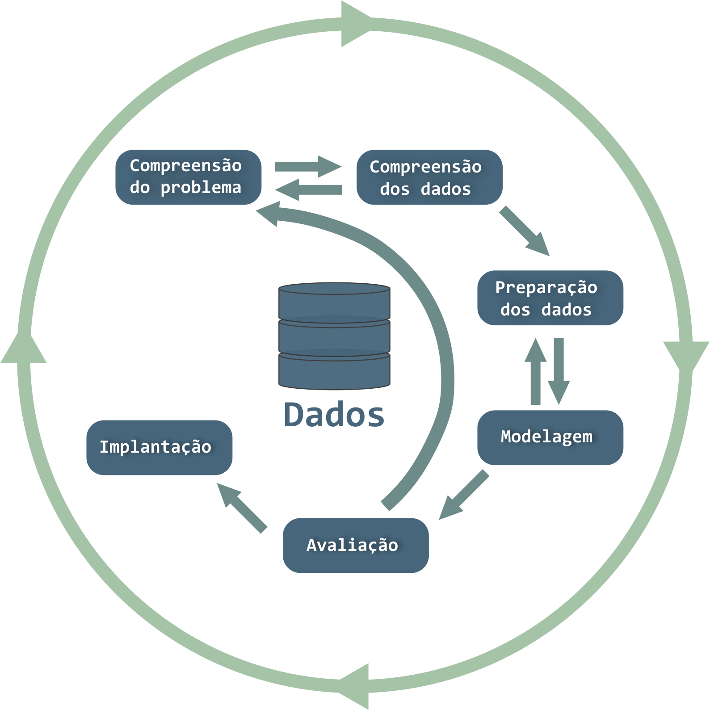

---


# Motivação

---

A quantidade de dados gerados diariamente vem aumentando exponencialmente, tornando a análise de dados cada vez mais importante

  

---

**Negócios:** tomada de decisões baseadas em dados

---

**Saúde:** descobrir novos tratamentos e medicamentos

---

**Segurança:** prever e prevenir crimes e ameaças

---

**Marketing:** segmentação de clientes e personalização de produtos/serviços

---



## O que é mineração de dados?

---

A **mineração de dados** é o processo de descobrir conhecimentos ocultos e padrões em grandes volumes de dados.

---

O **objetivo** da mineração de dados é transformar dados brutos em informações úteis e conhecimentos para a tomada de decisão.

---

Ela usa técnicas de aprendizado de máquina, estatística e inteligência artificial para analisar dados e extrair insights.

---

Essas técnicas transformam, de maneira inteligente e automática, os **dados** disponíveis em **informações** úteis, que representem o **conhecimento** para ser usado com **sabedoria**.

---

**Informação**, e não dados, valem dinheiro/tempo/conhecimento!

---



## Dado, informação, conhecimento e sabedoria

---

**Dado:** são fatos brutos, sem significado ou contexto, que podem ser registrados e armazenados.

---

**Informação:** é o resultado da organização e interpretação dos dados, dando-lhes significado e contexto.

---

**Conhecimento:**  é a compreensão dos relacionamentos entre as informações e a capacidade de aplicar essas informações em uma situação específica.

---

**Sabedoria:**  é a habilidade de usar o conhecimento de forma ética e eficaz para tomar decisões sábias.

---



## CRISP-DM, SEMMA e KDD

---

- Existem várias metodologias para gerenciar projetos de mineração de dados.

- Três das metodologias mais comuns são CRISP-DM, SEMMA e KDD.

---



## CRISP-DM

---

- CRISP-DM (**CR**oss **I**ndustry **S**tandard **P**rocess for **D**ata **M**ining) é uma metodologia de mineração de dados amplamente utilizada.

- Envolve **seis etapas**: compreensão do negócio, compreensão dos dados, preparação dos dados, modelagem, avaliação e implementação.

- É uma abordagem iterativa e pode ser adaptada para atender a necessidades específicas do projeto.

---

### CRISP-DM

---

#### Compreensão do negócio

- Nesta fase, o objetivo é entender os objetivos do projeto, identificar as necessidades do usuário e definir os critérios de sucesso.

&nbsp;

- É importante definir claramente o escopo do projeto e entender os recursos disponíveis.

---

#### Compreensão dos Dados

- Nesta fase, o objetivo é coletar, limpar, integrar e explorar os dados.

&nbsp;

- É importante identificar a qualidade dos dados, definir as variáveis relevantes e compreender a estrutura dos dados.

---

#### Preparação dos Dados

- Nesta fase, o objetivo é selecionar as variáveis relevantes, transformar os dados e criar conjuntos de dados de treinamento e teste.

&nbsp;

- É importante garantir que os dados estejam limpos, completos e estruturados de maneira adequada para a modelagem.

---

#### Modelagem

- Nesta fase, o objetivo é construir e avaliar modelos que possam prever ou classificar novos casos.

&nbsp;

- É importante selecionar as técnicas de modelagem apropriadas e avaliar a eficácia do modelo usando conjuntos de dados de treinamento e teste.

---
  

#### Avaliação

- Nesta fase, o objetivo é avaliar a eficácia do modelo em relação aos critérios de sucesso definidos na fase de compreensão do negócio.

&nbsp;

- É importante avaliar o modelo em conjuntos de dados de teste independentes e garantir que ele atenda aos requisitos do usuário.

---

#### Implantação

- Nesta fase, o objetivo é implantar o modelo em um ambiente de produção e monitorá-lo regularmente para garantir que continue a atender aos requisitos do usuário.

&nbsp;

- É importante desenvolver um plano de implantação e treinamento para garantir que o modelo seja adotado pelos usuários.

---



## SEMMA

---

- SEMMA (**S**ample, **E**xplore, **M**odify, **M**odel, **A**ssess) é uma metodologia de mineração de dados desenvolvida pela SAS.

- Envolve **cinco etapas**: amostragem, exploração, modificação, modelagem e avaliação.

- SEMMA é uma abordagem focada no modelo e pode ser usada em conjunção com outras metodologias de gerenciamento de projetos.

---

### SEMMA

---

#### Amostragem

- Nesta fase, o objetivo é selecionar um subconjunto representativo dos dados originais.

&nbsp;

- É importante garantir que a amostra seja grande o suficiente para fornecer resultados precisos e confiáveis.

---

#### Exploração

- Nesta fase, o objetivo é explorar os dados selecionados na etapa anterior e identificar padrões ou tendências.

&nbsp;

- É importante visualizar os dados para identificar padrões facilmente e identificar outliers.

---

#### Modificação

- Nesta fase, o objetivo é transformar os dados de forma apropriada para que possam ser usados na modelagem.

&nbsp;

- É importante realizar a limpeza dos dados, selecionar as variáveis relevantes e transformar os dados para que possam ser usados na modelagem.

---

#### Modelagem

- Nesta fase, o objetivo é criar e testar modelos usando os dados preparados na etapa anterior.

&nbsp;

- É importante selecionar as técnicas de modelagem apropriadas e avaliar a eficácia do modelo usando conjuntos de dados de treinamento e teste.

---

#### Avaliação

- Nesta fase, o objetivo é avaliar a eficácia do modelo em relação aos critérios de sucesso definidos na fase de amostragem.

&nbsp;

- É importante avaliar o modelo em conjuntos de dados de teste independentes e garantir que ele atenda aos requisitos do usuário.

---



## KDD

---

- KDD (**K**nowledge **D**iscovery in **D**atabases) é uma metodologia mais ampla que CRISP-DM e SEMMA.

- Envolve basicamente **três etapas**: pré-processamento, mineração de dados e pós-processamento.

---

Pré-processamento inclui limpeza, integração e transformação de dados. A mineração de dados inclui seleção, pré-processamento e modelagem de dados. O pós-processamento inclui interpretação e avaliação dos resultados.

---

### KDD

---

#### Seleção

- Nesta fase, o objetivo é selecionar os dados relevantes para o problema de mineração.

&nbsp;

- É importante identificar as fontes de dados relevantes e escolher as variáveis de interesse.

---

#### Pré-processamento

- Nesta fase, o objetivo é preparar os dados para análise.

&nbsp;

- É importante lidar com valores ausentes, tratar outliers e realizar normalização ou padronização de variáveis.

---

#### Limpeza

- Nesta fase, o objetivo é identificar e corrigir erros nos dados.

&nbsp;

- É importante lidar com dados duplicados, corrigir erros de digitação e identificar e tratar valores discrepantes.

---

#### Transformação

- Nesta fase, o objetivo é transformar os dados em uma forma que seja adequada para a análise.

&nbsp;

- É importante realizar transformações como discretização, agregação, e normalização para que os dados possam ser usados com sucesso na modelagem.

---

#### Mineração de dados

- Nesta fase, o objetivo é aplicar técnicas de mineração de dados para identificar padrões e relacionamentos nos dados.

&nbsp;

- É importante escolher as técnicas de mineração de dados apropriadas e avaliar a eficácia dos modelos gerados.

---

#### Interpretação e avaliação

- Nesta fase, o objetivo é interpretar os resultados da mineração de dados e avaliar sua relevância para o problema de negócio.

&nbsp;

- É importante avaliar a eficácia dos modelos gerados e determinar se as descobertas são significativas e úteis.

---

---



## Qual metodologia utilizar?

---

CRISP-DM, SEMMA e KDD são todas metodologias amplamente utilizadas para gerenciamento de projetos de mineração de dados.

---

CRISP-DM é uma abordagem iterativa em cascata, SEMMA é uma abordagem em cascata focada no modelo e KDD é uma metodologia mais ampla com três etapas principais.

---

A escolha da metodologia dependerá das necessidades específicas do projeto e dos recursos disponíveis para o gerenciamento do projeto.