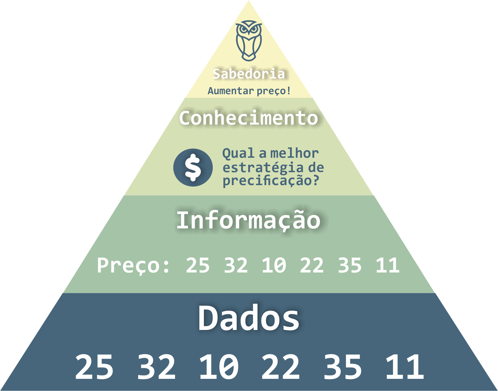

---


# Motivação

---

A quantidade de dados gerados diariamente vem aumentando exponencialmente, tornando a análise de dados cada vez mais importante

  

---

**Negócios:** tomada de decisões baseadas em dados

---

**Saúde:** descobrir novos tratamentos e medicamentos

---

**Segurança:** prever e prevenir crimes e ameaças

---

**Marketing:** segmentação de clientes e personalização de produtos/serviços

---



## O que é mineração de dados?

---

A **mineração de dados** é o processo de descobrir conhecimentos ocultos e padrões em grandes volumes de dados.

---

O **objetivo** da mineração de dados é transformar dados brutos em informações úteis e conhecimentos para a tomada de decisão.

---

Ela usa técnicas de aprendizado de máquina, estatística e inteligência artificial para analisar dados e extrair insights.

---

Essas técnicas transformam, de maneira inteligente e automática, os **dados** disponíveis em **informações** úteis, que representem o **conhecimento** para ser usado com **sabedoria**.

---

**Informação**, e não dados, valem dinheiro/tempo/conhecimento!

---



## Dado, informação, conhecimento e sabedoria

---

**Dado:** são fatos brutos, sem significado ou contexto, que podem ser registrados e armazenados.

---

**Informação:** é o resultado da organização e interpretação dos dados, dando-lhes significado e contexto.

---

**Conhecimento:**  é a compreensão dos relacionamentos entre as informações e a capacidade de aplicar essas informações em uma situação específica.

---

**Sabedoria:**  é a habilidade de usar o conhecimento de forma ética e eficaz para tomar decisões sábias.

